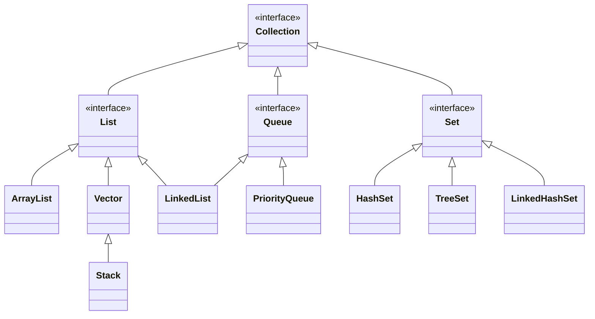
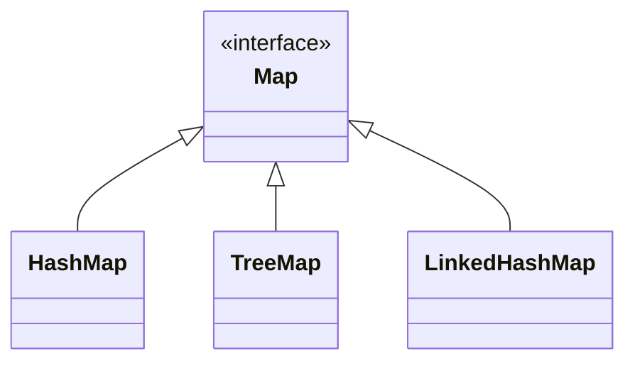

# Java Collections (Koleksiyonlar)

Java Collections Framework (Koleksiyonlar Çatısı), Java'da veri yapıları ve algoritmalarını standartlaştırmak için geliştirilmiş bir API'dir. Koleksiyonlar, birden fazla veriyi bir arada tutmak, yönetmek ve işlemek için kullanılır.

## Nereden Geldi?

Java Collections Framework, Java 1.2 sürümüyle (1998) birlikte gelmiştir. Öncesinde Java'da veri tutmak için sadece diziler (`Array`) ve bazı özel sınıflar (`Vector`, `Hashtable`) vardı. Collections Framework ile birlikte, veri yapıları ve algoritmalar tek bir çatı altında toplandı ve standart bir yapı sunuldu.

## Collections Framework'ün Temel Yapısı

- **Interface'ler:** `Collection`, `List`, `Set`, `Queue`, `Map`
- **Sınıflar:** `ArrayList`, `LinkedList`, `HashSet`, `TreeSet`, `PriorityQueue`, `HashMap`, `TreeMap` vb.
- **Algoritmalar:** Sıralama, arama, kopyalama, karıştırma gibi işlemler için yardımcı metotlar (`Collections` sınıfı).

## Collections Framework Neleri Çözer?

- **Veri Saklama:** Farklı veri tiplerini ve miktarlarını esnek şekilde saklama.
- **Veri İşleme:** Sıralama, arama, filtreleme, dönüştürme gibi işlemleri kolaylaştırma.
- **Null ve Tip Güvenliği:** Modern koleksiyonlar generic (jenerik) yapıdadır, tip güvenliği sağlar.
- **Performans:** Farklı veri yapıları ile performans ihtiyacına göre seçim yapabilme.
- **Kodun Okunabilirliği ve Bakımı:** Standart API ile kodun daha anlaşılır ve bakımı kolay olur.

## Collections Framework'e Dönüşüm

Önceki Java sürümlerinde kullanılan eski veri yapıları (`Vector`, `Hashtable`) Collections Framework ile modernleştirildi. Artık çoğu durumda `ArrayList`, `HashSet`, `HashMap` gibi sınıflar tercih edilir.





### Eski ve Yeni Karşılaştırması

```java
// Eski yöntem
Vector<String> vector = new Vector<>();
Hashtable<Integer, String> hashtable = new Hashtable<>();

// Modern yöntem
ArrayList<String> list = new ArrayList<>();
HashMap<Integer, String> map = new HashMap<>();
```

## Collections Kullanımına Örnekler

### Liste (List)

```java
List<String> isimler = new ArrayList<>();
isimler.add("Ali");
isimler.add("Veli");
isimler.add("Ayşe");

System.out.println(isimler); // [Ali, Veli, Ayşe]
```

**Açıklama:**  
`List` arayüzü, sıralı ve tekrarlı elemanları tutar. `ArrayList` ise en çok kullanılan implementasyonudur.

### Küme (Set)

```java
Set<Integer> sayilar = new HashSet<>();
sayilar.add(1);
sayilar.add(2);
sayilar.add(2); // Tekrar eklenmez

System.out.println(sayilar); // [1, 2]
```

**Açıklama:**  
`Set` arayüzü, tekrarsız elemanları tutar. `HashSet` hızlı erişim sağlar.

### Harita (Map)

```java
Map<Integer, String> kisiler = new HashMap<>();
kisiler.put(1, "Ali");
kisiler.put(2, "Veli");

System.out.println(kisiler.get(1)); // Ali
```

**Açıklama:**  
`Map` arayüzü, anahtar-değer (key-value) çiftlerini tutar. `HashMap` en çok kullanılan implementasyonudur.

### Kuyruk (Queue)

```java
Queue<String> kuyruk = new LinkedList<>();
kuyruk.add("Ali");
kuyruk.add("Veli");

System.out.println(kuyruk.poll()); // Ali
```

**Açıklama:**  
`Queue` arayüzü, FIFO (First-In-First-Out) mantığıyla çalışır. `LinkedList` ile kolayca kullanılabilir.

## Collections Sınıfı ile Yardımcı Metotlar

```java
List<Integer> sayilar = Arrays.asList(5, 3, 8, 1);
Collections.sort(sayilar);
System.out.println(sayilar); // [1, 3, 5, 8]
```

**Açıklama:**  
`Collections` sınıfı, koleksiyonlar üzerinde çeşitli işlemler yapmaya yarayan statik metotlar içerir. Örneğin sıralama, karıştırma, maksimum/minimum bulma gibi.

## Collections Framework'ün Avantajları

- **Esneklik:** Farklı veri yapıları arasında kolayca geçiş yapılabilir.
- **Tip Güvenliği:** Jenerik yapısı sayesinde derleme zamanında tip hataları önlenir.
- **Zengin API:** Sıralama, arama, filtreleme gibi işlemler için hazır metotlar.
- **Performans:** İhtiyaca göre uygun veri yapısı seçilebilir.

## Sonuç

Java Collections Framework, modern Java uygulamalarında veri yönetimi için vazgeçilmezdir. Kodun daha güvenli, okunabilir ve bakımı kolay olmasını sağlar. Farklı veri yapıları ve algoritmalar ile her türlü veri işleme ihtiyacına çözüm sunar.
